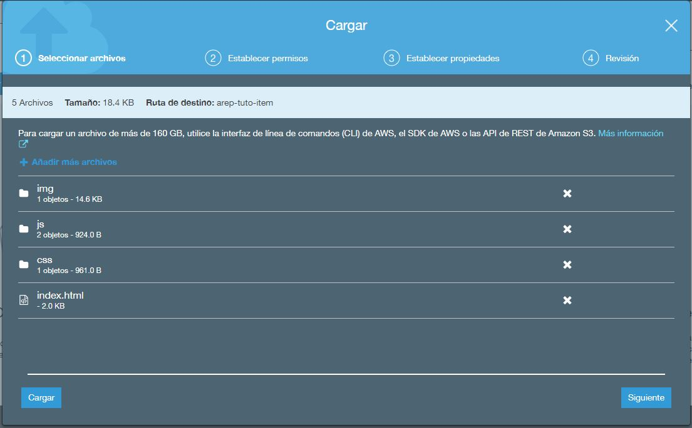

# AREP-Patrones-Arquitecturales

## Respos del front y back

- [Back](https://github.com/cdavidd/AREP-Patrones-Arquitecturales-back)
- [Front](https://github.com/cdavidd/AREP-PATRONES-FRONT)

## Configuraciones

### Base de datos Postgresql

1. Entraremos en nuestra cuenta de AWS y crearemos un nuevo servicio nos dirigimos a la parte de base de datos y escogemos RDS

   

2. Seleccionamos create database

   

3. Y seguimos los siguientes pasos

   

4. Llenamos los campos con la información de `usuario` y `contraseña`

   
   
   

5. Le daremos un `nombre` a nuestra base de datos en este caso _tuto_

   
   

6. Una vez terminada la configuración le damos crear
7. Ya creada copiaremos el `link de conexión`, el `puerto`, `nombre` de la base de datos, `usuario` y `contraseña`.

   

8. Pondremos estos datos en nuestra configuración a la base de datos.

   

9. Para tener conexión habilitaremos el puerto
   
   
   
   

### Instancia EC2

1. Entraremos a servicios y escogemos las siguientes opciones para la creación

   
   
   
   

2. Habilitamos el puerto de entrada 8080 ya que por este correrá nuestro servicio back.

   

3. Revisamos y creamos la instancia.

   

4. Crearemos o utilizaremos una llave para la conexión de la maquina

   

5. Seleccionamos la instancia y le damos conectar y seguimos los pasos de conexión.

   
   
   

6. Una vez conectado instalaremos Java, Maven y git

   **Java**:

   - sudo yum install -y java-1.8.0-openjdk-devel
   - sudo yum remove java-1.7.0-openjdk

   **Maven**:

   - wget https://downloads.apache.org/maven/maven-3/3.6.3/binaries/apache-maven-3.6.3-bin.tar.gz
   - cd /opt
   - sudo tar -xvzf /**_path donde descargo_**/apache-maven-3.6.3-bin.tar.gz
   - sudo vi /etc/profile y al final del archivo colocamos
   - export M2_HOME="/opt/apache-maven-3.6.3"
   - export PATH="$PATH:$M2_HOME/bin"
     
   - guardamos y salimos
   - . /etc/profile

   **Git**:

   - sudo yum install -y git

7. Revisamos que se hayan instalado

   

8. Clonamos el repositorio [Back](https://github.com/cdavidd/AREP-Patrones-Arquitecturales-back)

   

9. Entramos al folder del repositorio y ejecutaremos `mvn package` y `mvn spring-boot:run` para correr nuestro servicio
   

### Bucket S3

1. Clonaremos el repositorio [Front](https://github.com/cdavidd/AREP-PATRONES-FRONT) y modificaremos el siguiente archivo _static/js/apiItem.js_ donde pondremos el dns:8080/ítems de la ec2

   

2. Ahora crearemos un Bucket s3

   

3. Le daremos en Empezar o Create Bucket

   

4. Asignamos un nombre a nuestro servicio

   

5. Permitimos el acceso público y creamos

   

6. Ingresamos a nuestro Bucket y seleccioamos cargar

   

7. Arrastamos el contenido de la carpeta static
   
   

8. Le damos permisos publicos al contenido

   

9. Ingresamos al archivo Index.html y copiamos el URL
   
   
10. Ingresamos y verificamos que estemos por http y no por https
    

11. Llenamos los espacios y tratamos de insertar un ítem  
    

12. Para comprobar que se insertó nos dirigimos al dns de la EC2 /items o nos conectamos a la base de datos para rectificar.
